# Lab 1 — CTI Report Mapping to MITRE ATT&CK

 1. Group Members

* Aviv Rom Horesh — 315129775

 2. Source CTI Report

**Report:** CL-STA-1062 Targets Southeast Asian Governments and Critical Infrastructure
**Source:** Palo Alto Networks Unit 42
**Link:** https://unit42.paloaltonetworks.com/cl-sta-1062-tinyrct-backdoor/

 3. Short Attack Summary

The report describes a cyber-espionage campaign attributed to CL-STA-1062, a Chinese-speaking threat activity cluster targeting government entities and critical infrastructure in Southeast Asia. The activity mainly focused on state-owned organizations in the energy and government sectors, making it significant because these sectors may contain sensitive strategic, operational, and national-level information.

According to Unit 42, the attackers used a hybrid toolkit that combined publicly available tools, such as SoftEther VPN, Mimikatz and VNT, with a newly documented custom backdoor named TinyRCT. In one observed intrusion, the attackers compromised a Southeast Asian government entity, deployed ASPX web shells, and exfiltrated database information from an MS SQL server. During the same campaign, they also conducted network reconnaissance against another government entity in the same country, which suggests an attempt to identify lateral movement opportunities and expand their access.

TinyRCT is a lightweight C#/.NET-based remote access Trojan that functions as a backdoor on Windows systems. Its capabilities include arbitrary command execution, file enumeration and exfiltration, screenshot capture, and a self-destruct mechanism. Before entering its main command loop, TinyRCT collects host information such as the current username, machine name, operating system version, local IP addresses, malware execution path, process ID, and a generated GUID used as a bot identifier. Overall, the campaign demonstrates how attackers can combine common administrative or offensive tools with custom malware to maintain access, collect intelligence, and exfiltrate sensitive data from high-value targets.

 4. Attack Sequence

```mermaid
flowchart LR
    subgraph Access["Access"]
        A[Initial Compromise<br/>Government and Energy Entities]
        B[Deploy ASPX Web Shells<br/>Remote Access and Command Execution]
    end

    subgraph Discovery["Discovery"]
        C[System and Network Reconnaissance<br/>Enumerate Victim Environment]
        D[Traceroute<br/>Identify Lateral Movement Paths]
        E[Send Enumeration Results<br/>curl to Actor-Controlled Infrastructure]
    end

    subgraph Tooling["Tool Deployment"]
        F[Download Additional Tools<br/>SoftEther VPN, VNT, RAR Archives]
        G[Masquerade Tools<br/>Disguised as Legitimate Files]
    end

    subgraph Control["Control and Escalation"]
        H[VPN / Tunneling<br/>C2 and Data Exfiltration]
        I[Privilege Escalation<br/>JuicyPotato]
    end

    subgraph Exfiltration["Collection and Exfiltration"]
        J[Data Staging<br/>Password-Protected RAR Archives]
        K[Data Exfiltration<br/>MSSQL Data and Web Server Source Code]
    end

    A --> B --> C --> D --> E --> F --> G --> H --> I --> J --> K
```

5. MITRE ATT&CK Mapping

| Tactic | Technique | Behavior from the Report | ATT&CK Link |
|---|---|---|---|
| Initial Access | Exploit Public-Facing Application — T1190 | The attackers compromised internet-facing web applications belonging to government and critical infrastructure entities. | https://attack.mitre.org/techniques/T1190/ |
| Persistence | Server Software Component: Web Shell — T1505.003 | The attackers deployed ASPX web shells on compromised servers to maintain access and execute commands. | https://attack.mitre.org/techniques/T1505/003/ |
| Execution | Command and Scripting Interpreter: Windows Command Shell — T1059.003 | The attackers used web shells to execute commands on compromised Windows servers. | https://attack.mitre.org/techniques/T1059/003/ |
| Discovery | System Information Discovery — T1082 | TinyRCT and attacker commands collected host information such as OS version, machine name, username and process information. | https://attack.mitre.org/techniques/T1082/ |
| Discovery | System Network Configuration Discovery — T1016 | The attackers collected network configuration details, including IP-related information, to understand the victim environment. | https://attack.mitre.org/techniques/T1016/ |
| Discovery | Remote System Discovery — T1018 | The attackers used reconnaissance activity, including traceroute, to identify possible lateral movement paths to other government entities. | https://attack.mitre.org/techniques/T1018/ |
| Command and Control | Application Layer Protocol: Web Protocols — T1071.001 | TinyRCT communicated with attacker-controlled infrastructure over HTTP-based C2 communication. | https://attack.mitre.org/techniques/T1071/001/ |
| Command and Control | Proxy — T1090 | The attackers used VPN/tunneling tools such as SoftEther VPN and VNT to support C2 and data movement. | https://attack.mitre.org/techniques/T1090/ |
| Command and Control | Protocol Tunneling — T1572 | The attackers used tunneling/VPN tools to conceal or route malicious communications through the victim environment. | https://attack.mitre.org/techniques/T1572/ |
| Defense Evasion | Masquerading — T1036 | The attackers disguised tools as legitimate-looking files, such as masquerading a SoftEther VPN binary as `vmtools.exe`. | https://attack.mitre.org/techniques/T1036/ |
| Privilege Escalation | Exploitation for Privilege Escation — T1068 | The attackers used JuicyPotato to escalate privileges within the compromised environment. | https://attack.mitre.org/techniques/T1068/ |
| Credential Access | OS Credential Dumping — T1003 | The attackers used Mimikatz, a known credential dumping tool, to access credential material. | https://attack.mitre.org/techniques/T1003/ |
| Collection | Screen Capture — T1113 | TinyRCT included the capability to capture screenshots from the infected host. | https://attack.mitre.org/techniques/T1113/ |
| Collection | Archive Collected Data — T1560 | The attackers compressed collected data into password-protected RAR archives before exfiltration. | https://attack.mitre.org/techniques/T1560/ |
| Exfiltration | Exfiltration Over C2 Channel — T1041 | The attackers exfiltrated data through attacker-controlled infrastructure and C2-related channels. | https://attack.mitre.org/techniques/T1041/ |

6. Insights / What We Learned

This lab helped us understand how real-world CTI reports can be translated into structured MITRE ATT&CK mappings. We learned that the same attack campaign may include many different behaviors, such as initial access, reconnaissance, credential access, command and control, data staging and exfiltration. The analysis also showed that attackers often combine publicly available tools with custom malware, making it important to focus not only on tool names, but also on the actual behavior performed by the attackers.
